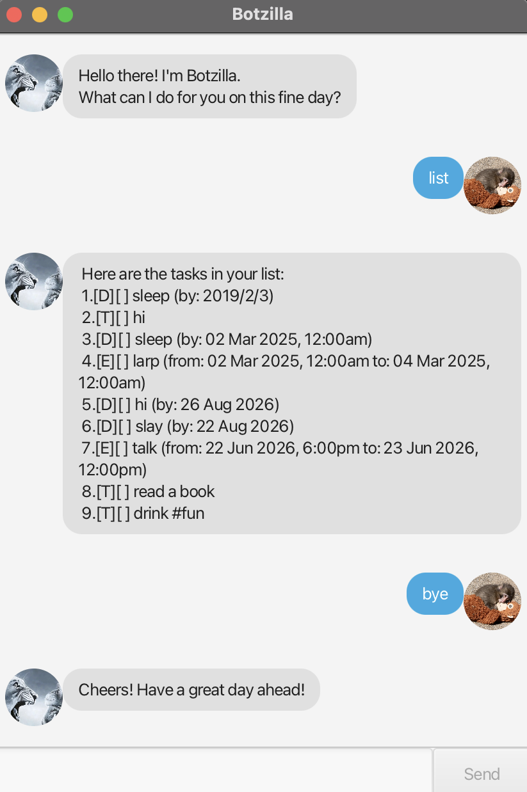

# Botzilla User Guide

**Botzilla** is a desktop chatbot that helps you track todos, deadlines, and events through a simple, typed-command interface — no clicking through menus required. If you can type fast, Botzilla can manage your tasks faster than a typical GUI app can.



## Quick start

1. Make sure you have **Java 25** installed.
2. Download the latest `botzilla.jar` (or build it from source with `./gradlew shadowJar`).
3. Run it from a terminal in the folder containing the jar:
   ```
   java -jar botzilla.jar
   ```
   A chat window should appear, with Botzilla's greeting already waiting for you.
4. Type a command into the text box at the bottom and press **Enter** (or click **Send**), e.g. `list`.
5. Refer to [Commands](#commands) below for everything Botzilla understands.

> [!TIP]
> Your tasks are saved automatically after every change, to `./data/botzilla.txt` next to wherever you run the jar from. You don't need to save manually, and your list will still be there the next time you open Botzilla.

## Features

- **Todos** — one-off tasks with just a description.
- **Deadlines** — tasks due by a specific date/time.
- **Events** — tasks that run from a start date/time to an end date/time.
- **Mark / unmark** — track which tasks are done.
- **Delete** — remove a task you no longer need.
- **Find** — search your tasks by keyword.
- **On** — see everything due/happening on a specific date.
- **Tags** — label tasks with your own `#tag`s, either inline while adding them or afterwards with `tag`/`untag`.

## Commands

Botzilla understands the commands below. `<n>` always means a task's number as shown by `list`, counting from 1.

| Command | Format | Example | What it does |
|---|---|---|---|
| Add a todo | `todo <description>` | `todo read book` | Adds a todo with no date. |
| Add a deadline | `deadline <description> /by <date>` | `deadline return book /by 2/12/2019 1800` | Adds a task due by the given date/time. |
| Add an event | `event <description> /from <date> /to <date>` | `event project meeting /from 2/12/2019 1400 /to 2/12/2019 1600` | Adds a task spanning from a start to an end date/time. |
| List tasks | `list` | `list` | Shows every task, numbered. |
| Mark as done | `mark <n>` | `mark 1` | Marks task `<n>` as done. |
| Mark as not done | `unmark <n>` | `unmark 1` | Marks task `<n>` as not done. |
| Delete | `delete <n>` | `delete 1` | Removes task `<n>` from the list. |
| Find | `find <keyword>` | `find book` | Lists tasks whose description contains the keyword (case-insensitive). |
| Tasks on a date | `on <date>` | `on 2/12/2019` | Lists deadlines/events falling on that date. |
| Add tag(s) | `tag <n> <tag> [more tags...]` | `tag 1 fun urgent` | Adds one or more tags to task `<n>`. |
| Remove tag(s) | `untag <n> <tag> [more tags...]` | `untag 1 fun` | Removes one or more tags from task `<n>`. |
| Exit | `bye` | `bye` | Closes Botzilla. |

### Dates and times

Give dates in **`d/M/yyyy`** format, optionally followed by a 24-hour, 4-digit time (**`HHmm`**):

```
2/12/2019
2/12/2019 1800
```

> [!NOTE]
> `deadline` and `event` will still accept free text that isn't shaped like a date (e.g. `deadline submit form /by end of semester`) — Botzilla just displays it as-is rather than treating it as a real date. A free-text date won't show up under the `on` command, since there's no calendar date to match against. The `on` command itself always needs a real, valid `d/M/yyyy` date.

### Tagging as you add a task

Instead of tagging afterwards, you can drop `#tagName` anywhere in a `todo`/`deadline`/`event` description while creating it:

```
todo read book #fun #easy
deadline submit report /by 2/12/2019 1800 #urgent
```

### Task list display

Each task in `list`/`find`/`on` output is shown with a type icon and a done marker:

- `[T]` Todo · `[D]` Deadline · `[E]` Event
- `[X]` done · `[ ]` not done

```
1.[T][X] read book #fun
2.[D][ ] return book (by: 02 Dec 2019, 6:00pm) #urgent
```

## Errors Botzilla catches for you

Botzilla checks your input before acting on it, so a typo doesn't quietly corrupt your task list. It will tell you (rather than silently guessing) when:

- a required part of a command is missing, e.g. `mark` with no task number, or `deadline` with no `/by` date;
- `/by`, `/from`, or `/to` is given more than once in the same command;
- a date isn't a real calendar date (e.g. `30/2/2019`) or a time is out of range (e.g. `2500`);
- an event's `/from` time isn't before its `/to` time;
- you try to add a task that's identical (same type, name, and date(s)) to one already on your list;
- a tag contains anything other than letters, numbers, or underscores.

In every case, Botzilla leaves your existing tasks untouched and explains what to fix.
